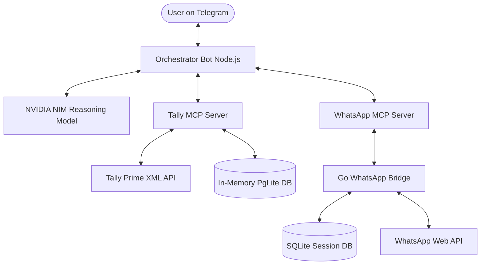

# Telegram Tally Bot v5.0 — Multi-Agent ERP Assistant

An intelligent, production-ready, open-source **Telegram Bot Orchestrator** that bridges **Tally Prime ERP** and **WhatsApp** using the **Model Context Protocol (MCP)**. Powered by a high-performance reasoning LLM (NVIDIA NIM / Nemotron), it provides text- and voice-based (Hinglish/Hindi/English) interfaces for live database queries, collection tracking, PDF statements, receipt bookkeeping, and payment reminders.

---

## 🚀 Key Features

*   **Natural Language interface (Hindi / Hinglish / English)**: Ask things like *"Mittal Ji ka outstanding kitna hai?"* or *"Dhodhar mein kitne customers hain?"*.
*   **Multi-Agent Architecture**: Seamlessly coordinates specialized tool calls across:
    *   **Tally MCP Server**: Communicates with Tally Prime XML/database and caches records in an in-memory SQL database (PgLite) for self-healing SQL analytical queries.
    *   **WhatsApp MCP Server**: Queries your personal WhatsApp contacts, reads/downloads incoming media, and drafts outgoing notifications.
*   **Autonomous Ledger Matching**: Safely matches ledgers with phonetic fuzzy matching, preventing false positives via an ambiguity detection score gap.
*   **Automatic FIFO Payment Reminders**: Auto-allocates payments against outstanding invoices and drafts customized WhatsApp notices with custom UPI links.
*   **Draft Voucher Bookkeeping**: Save voucher drafts (e.g. cash receipts, receipt books) into the database for review on your Web Dashboard.
*   **Voice Transcription Integration**: Uses Sarvam AI for fast and accurate transcription of voice messages.
*   **Resilient Markdown & Self-Healing SQL**: Handles SQL error recovery (case-sensitive column auto-quoting) and fallback plain-text rendering for Telegram formatting errors.

---

## 🛠️ System Architecture



Read our full [Architecture Guide](ARCHITECTURE.md) to understand more.

---

## 💻 Installation & Setup

To run this project as a **plug-and-play** repository, follow these setup steps:

### 1. Prerequisites
Ensure you have the following installed on your machine:
*   [Node.js](https://nodejs.org/) (v18+)
*   [Go](https://go.dev/) (only if compiling/building the Go bridge from source)
*   [Python / uv](https://astral.sh/uv) (for running python MCP services)
*   A C compiler (e.g. MSYS2/GCC on Windows) for SQLite native dependencies

### 2. Configure Environment Variables
Clone the repository, duplicate the `.env.example` file to `.env`, and fill in your details:
```bash
cp .env.example .env
```

Key configuration parameters inside `.env`:
*   `BOT_TOKEN`: Your Telegram Bot API token (obtained from `@BotFather`).
*   `ALLOWED_USER_ID`: Comma-separated list of Telegram User IDs authorized to interact with the bot.
*   `DEFAULT_UPI_ID`: Default merchant UPI ID to receive payments (e.g. `yourname@ybl`).
*   `LLM_API_KEY`: NVIDIA NIM API credentials.
*   `TALLY_PORT`: Local port where Tally Prime is running (default: `9000`).

---

## 🏃‍♂️ Running the Services

The system runs on a **three-tier architecture**. Start each tier in order:

### Tier 1: Start Tally Prime ERP
1.  Open **Tally Prime** on your computer.
2.  Enable the XML / ODBC server on port `9000` (Configure -> Connectivity -> ODBC/Tally.Developer Service).
3.  Open the desired company.

### Tier 2: Run the WhatsApp Bridge
The Go bridge maintains WhatsApp web authentication and session databases.
1.  Navigate to the bridge directory:
    ```bash
    cd whatsapp-mcp/whatsapp-bridge
    ```
2.  Start the pre-compiled executable (Windows):
    ```powershell
    .\whatsapp-bridge.exe
    ```
    *(If running on a non-Windows OS, rebuild it from source using `go run main.go` / `go build -o whatsapp-bridge`).*
3.  On the first startup, scan the printed **QR code** in the terminal using your WhatsApp mobile application (Linked Devices) to pair. Once paired, it will save the session in `store/` and run silently.

### Tier 3: Run the Bot Orchestrator
In the project root folder, start the bot:
```bash
npm install
npm start
```
The node application will boot up, spin up the Tally and WhatsApp MCP servers, and report:
`🚀 Tally AI Bot (v5.0 - Multi-Agent Architecture) Ready!`

---

## 🧪 Running Tests

To verify that Tally database queries and LLM configurations are working fine, you can run the integration tests:
```bash
# Test Tally database and collection queries
node tests/test_tally.js

# Test NVIDIA NIM reasoning integration
node tests/test_llm.js
```

---

## 📜 License

This project is licensed under the **ISC License**. Feel free to fork, adapt, and build on top of it.
